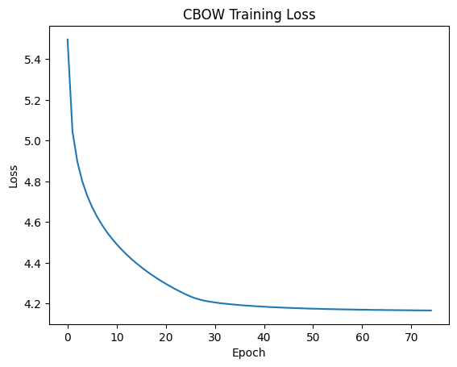

**Dataset**

Toxic Comments Classification: https://www.kaggle.com/competitions/jigsaw-toxic-comment-classification-challenge/data

This is a multi-label classification dataset

---

**Dataset Processing**

1. Lowercasing
2. Text Cleaning: Removing "http" characters
3. Applying lemmatization using NLTK
4. Tokenizing sentences
5. Construction vocabulary for CBoW

---

**Continuous Bag of Words Embedding**

A CBoW model was trained from scratch to learn distributed word representations.

Objective: Given surrounding context words, predict the center word. The learned embedding matrix was later reused by the toxicity classifier.

Configuration:
|   Parameter   |   Value   |
|---------------|-----------|
|Embedding dimension|   300 |
|Context Window|    3   |
|   Epochs  |   75  |
|Vocabulary Size|   51017   |    

Results:



---

**Toxicity Classifer**

#### Architecture:

Input Tokens --> Embedding Layer (CBOW Weights) --> Average Pooling --> Linear Layer --> 6 Output Logits


Training Parameters:

|   Loss Function   |   BCEWithLogitsLoss |
|   Learning Rate  | 1e-3 |
|   Optimizer   |   Adam    |
|   Epochs  |   25 with early stopping (stopped at 18)  |
|   Early Stopping Criteria    |   AUC does not increase for 3 epochs |
|   Batch Size  |   512 |

---

**Evaluation Metrics**

The following metrics were used:

- Macro ROC-AUC
- Per-Class ROC-AUC
- Micro F1 Score
- Macro F1 Score
- Classification Report (Recall, Precision & F1)

Why Multiple Metrics?

- ROC-AUC measures ranking quality independent of threshold selection.
- Macro F1 evaluates performance equally across all classes (will show impact of rare classes).
- Micro F1 reflects overall prediction quality and is influenced by common classes.
- Per-class metrics help identify weaknesses in rare categories such as Threat and Identity Hate.

Initial evaluation used a global threshold of 0.5.

Analysis of ROC-AUC and per-class F1 scores revealed that rare classes were being predicted too conservatively.

A per-class threshold search was performed to maximize F1 score for each label.

- Optimal Thresholds

|   Class   |   Threshold   |
|-----------|---------------|
|   toxic   |	0.65    |
|severe_toxic|	0.45    |
|obscene|	0.45    |
|threat|    0.10    |
|insult|	0.44    |
|identity_hate| 0.27    |

---

**Final Results**

- Per-Class ROC-AUC

|Class|	ROC-AUC|
|-----|--------|
|toxic|	0.9546 |
|severe_toxic|	0.9857  |
|obscene|	0.9686  |
|threat|	0.9632  |
|insult|	0.9626  |
|identity_hate|	0.9538  |

- Overall Metrics

|Metric|	Score after applying per-class threshold  |Score before applying per-class threshold|
|------|------------|------------|
|Macro ROC-AUC|	0.9648  |0.9648|
|Micro F1|	0.6347  |0.6345|
|Macro F1|	0.5048  |0.4340|

- Per-Class F1 Scores

|Class|	F1 Score after applying per-class threshold   |F1 Score before applying per-class threshold|
|------|------------|---------|
|toxic|	0.68    |0.67|
|severe_toxic|	0.45    |0.42|
|obscene|	0.69    |0.68|
|threat|	0.23    |0.03|
|insult|	0.62    |0.61|
|identity_hate|	0.37    |0.20|

---

**Key Observations**

- Custom CBOW embeddings successfully captured semantic information from toxic comments.
- The classifier achieved a strong Macro ROC-AUC of 0.9648 despite its simple architecture.
- Rare classes such as Threat and Identity Hate were significantly affected by threshold selection.
- Per-class threshold optimization improved Macro F1 from: 0.4340 → 0.5048 without retraining the model.
- High ROC-AUC combined with low F1 on rare classes indicated that the model learned useful rankings but required threshold calibration.

---

### **How to run**

1. Clone the repository:

```bash
git clone https://github.com/karimm-ai/CBoW-toxic-comments-classification.git
```

2. Create a virtual environment (Optional but recommended) & activate it

3. Install requirements

```bash
pip install -r requirements.txt
```

4. Install torch or torch cuda. I use the below torch cuda wheel but it's dependent on the GPU. Mine is RTX5070 8GB.

```bash
pip install --pre torch torchvision torchaudio --index-url https://download.pytorch.org/whl/nightly/cu128
```

5. Download "best_cbow_model.pth" from drive: https://drive.google.com/file/d/1gX5vvDAKKBUNSnPgU028b3i0NwjIwo6E/view?usp=sharing

6. Run notebook cells

---

**Future Improvements**

- Apply class-weighted BCE loss
- Oversample rare classes
- Use BiLSTM architectures or Transformer-based models

---

This project is for educational and research purposes.

---